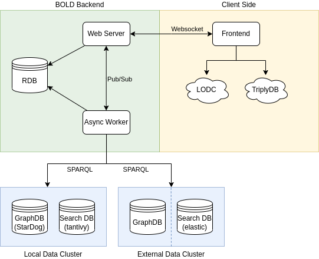

# BOLD Architecture
This document is currently aimed at being a quick introduction to help a potentially new contributor understand how to navigate this project.

The BOLD architecture is designed to be scaleable and to handle datasets of all sizes. Therefore we keep the data and the code separate. 
Additionally, we define asynchronous execution architecture to allow for parallel execution of queries, dataset imports and fault tolerance.

A high level overview of the architecture can be seen in the following figure.

In the above image we see the described separation.
Keeping the analysis and visualization extensible is another important goal of the BOLD platform.
To achieve this we aim to separete the analysis and visualization from the execution logic by strictly assigning these roles to the frontend and backend, respectively.

The backend is responsible for the execution of queries and the data management.
It recieves an execution plan in form a report and report cells containing sparql queries and executes them in parallel given the dataset.
Similarly, the import logic does not work with third party services, but with rdf or sparql endpoint urls directly.

The data is either stored in a self-hosted local data cluster or is accessed in a read-only fashion from a external data clusters using SPARQL and elasticsearch endpoints.

## Import Flow
While the import flow varies depending on the dataset and configuration, the general flow can be seen in the figure below.

The dataset urls are retrieved from a third party service ([Linked Open Data Cloud](https://lod-cloud.net/) or [TriplyDB](https://triplydb.com/)) and sent to the backend for import.

The backend stores the import metadata and schedules an asynchronous import job which is passed to one of the worker nodes (see [celery](https://github.com/celery/celery)).

The worker node is responsible for importing the dataset (if applicable) and importing it into the graph database ([StarDog](https://www.stardog.com/)).
Once the import is complete a search index is created by collecting all the entities from the dataset.
Additionally, various queries are run to compute the dataset statistics and check the health of the dataset.

Finally, the job results are persisted and the webserver is notified.

## Report Flow
The report flow is inspired by the [jupyter notebooks](https://jupyter.org/) workflow.
We have chosen to use our own workflow to allow easy addition of custom widgets, fuzzy term searching, self-hosting, and custom dataset import.

Flow for a simple report cell execution is shown in the figure below.

Report executions consists of two parts. 
(1) We save the report to run the up-to-date cells.
(2) We execute the cells in parallel.

Each cell execution job is passed onto a worker node (see [celery](https://github.com/celery/celery)).
The tasks query graph database and search the database. Once the result is known, it is saved to the database and the webserver (as well as client) is notified.
