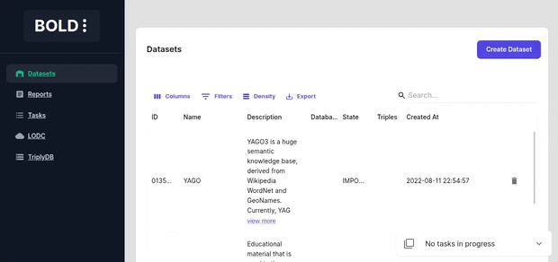
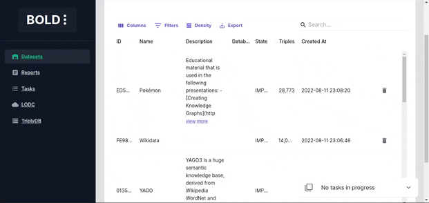
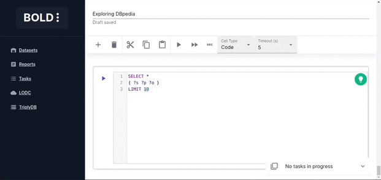
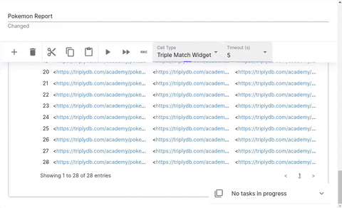

# User Manual
This document is aimed at new users who want learn or get an overview of the BOLD platform features.

## Definitions
### Dataset
> A BOLD dataset represents an (imported) RDF dataset. 
>
> The dataset consists of a SPARQL endpoint and a search index.
> Both can point to either a local of a remote resource.
> 
> The datasets can be shared between users and reports.

### Report
> A BOLD report represents a collection of cells that contain SPARQL queries and widgets.
> A report also persists all the query and widget results so that they can be reviewed later.

#### Report Cell
> A report cell contains either SPARQL queries or a configurable widget which generates queries for the database.

### Task
> A BOLD task represents a collection of work that can be scheduled and assigned to a worker.
> Tasks are meant to be used for long-running tasks and run in parallel to avoid blocking the main server.

## Basic Navigation
Navigate through the app by using the sidebar.

* Reports - Page to manage the reports.
* Datasets - Page to manage the datasets.
* Tasks - Page to view scheduled/completed tasks.
* LODC - Browse the LODC datasets
* TriplyDB - Browse the TriplyDB datasets

Filter the entities by defining custom filters and select specific columns to display.

## Importing Datasets
The datasets can be imported a multitude of sources.
There are two main ways to import datasets in BOLD.

* RDF Dataset - Import an RDF dataset by importing it into a local dataset and creating a search index. This requires the machine to have sufficient memory and storage to store the dataset.
* SPARQL Endpoint - Create a dataset from SPARQL endpoint and using an external search index. This does not require machine to have enough storage to store the dataset as it is accessed directly from the endpoint.

### Importing from Linked Open Data Cloud
Import a dataset from (linked open data cloud)[https://lod-cloud.net/datasets].
Since LODC stores links to external resources check whether the file is accessible before importing it by clicking the download link.

### Importing from Triply DB
Import a dataset from (Triply DB)[https://triplydb.com/].
When importing a SPARQL endpoint dataset from TriplyDB check whether a sparql service and elastic search services are running by visiting the dataset page ("services" tab).

### Importing from SPARQL endpoints
Importing from manual sparql endpoints currently only supports Wikimedia search api. If your dataset does not contain wikimedia data, then you are limited to simple code cell execution.

## Dataset Actions
Dataset deletion deletes the local dataset and the search index.

## Creating a Report
Create a report by selecting a dataset and adding cells to it.

## Report Cell Types
Report consists of cells that query the dataset SPARQL and search index and display the results in a persistent way.

### Prefixes
RDF iris are verbose and can be confusing to users. Define custom prefixes to shorten and make the iris more readable.

### Code Cell
Code cells allow you to execute SPARQL queries. The editor is powered by [yasqui](https://yasgui.triply.cc/). The defined prefixes can be used in autocompletion.

See [yasgui documentation](https://triply.cc/docs/yasgui#visualizations) to find out how to visualize your results in a more coherent way.

#### Code Generation using GPT
Writing SPARQL queries is a tedious task and is not always straightforward as it may require some knowledge of the underlying dataset.

To make it easier to write SPARQL queries, BOLD provides a utility to promt GPT to generate SPARQL queries for you. The specified prompt as well as the defined prefixes are used as context for the generation.

### Histogram Cell
The histogram cell displays the distribution of values for a certain property given a set of filters. 
This cell is perfect for finding biases in the data or getting important insights.

Various options are available to customize the histogram:

* **Group values of** - property whose values are used in the histogram
* **Filters** - filters to reduce number of matching entities before the histogram is generated
* **Continuous** - whether property values are continuous (e.g. interger, decimal, date) or discrete
* **Limit number of groups** - limits the number of bins in the histogram
* **Min group size** - minimum number of entities required to generate a group in the histogram
* **Temporal grouping** - Adds a third dimension to the histogram by creating a histogram for each time period given a temporal property.

The results are displayed in four tabs:

* **Plot** - The generated histogram
* **Table** - The data used to generate the histogram
* **Examples** - List of examples of entities that match the filters
* **Completeness Analysis** - Displays a ratio of entities that match the filters and have a defined property value versus the entities that dont have the property value.

### Triple Cell
The triple cell displays the triples that match the defined filters.

* **Limit number of results** - limits the number of entities displayed

### Class Tree Cell
The class tree cell displays the class hierarchy of the classes and properties in the dataset.
It can be used to get important insights in new data user wants to explore.

Various options are available to customize the class tree:

* **With counts** - Count the number of entities for each class and property'
* **With subclasses** - Include class subclasses in the tree
* **With equivalent classes** - Include equivalent classes in the tree
* **With keys** - Include keys in the tree for other reources
* **With properties** - Include class properties in the tree
* **Use owl classes** - Include owl classes in the tree
* **Use rdf classes** - Include rdf classes in the tree
* **Use any classes** - Include all classes in the tree

### Properties Cell
The properties cell displays the properties of a given entity.

### Subgraph Cell
The subgraph cell displays arbitrary depth the subgraph of a given entity by using properties as egdes.

Various options are available to customize the subgraph:

* **Target Entity** - The entity to start the subgraph from
* **Use any property** - Include all applicable properties in the subgraph or specify specific properties to use
* **Limit results** - Limits the number of nodes displayed
* **Limit depth** - Limits the depth of the subgraph

